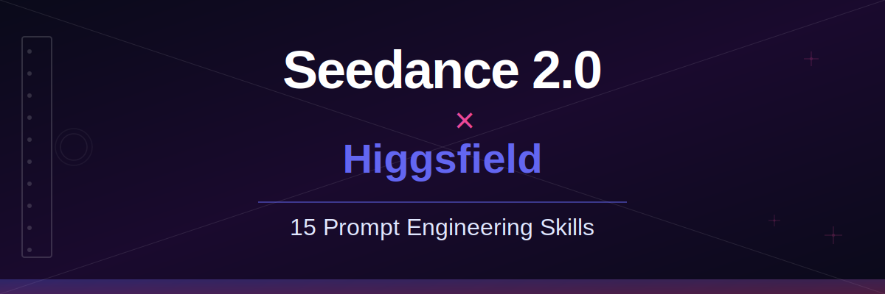

<p align="center">
  <a href="https://higgsfield.ai/create/video?model=seedance_2_0">
    
  </a>
</p>

<p align="center">
  <strong>🎬 higgsfield-seedance2</strong><br>
  <em>Seedance 2.0 × Higgsfield — Prompt Engineering Skills Collection</em>
</p>

<p align="center">
  <a href="https://higgsfield.ai">Higgsfield</a> ·
  <a href="https://higgsfield.ai/create/video?model=seedance_2_0">Create Video</a> ·
  <a href="https://x.com/higgsfield">𝕏 @higgsfield</a>
</p>

---

# What Is This?

16 specialized Claude skills built for Seedance 2.0 on Higgsfield. Each skill turns Claude into a prompt engineer for a specific video style — generating large, detailed, paste-ready prompts with powerful **2-second hooks** that stop the scroll.

👉 **[Start creating on Higgsfield](https://higgsfield.ai/create/video?model=seedance_2_0)**

---

<p align="center">
  
</p>

## What Each Skill Contains

- **2-Second Hook Framework** — 10-12 attention-grabbing opener patterns
- **Timeline Segmentation** — Beat-by-beat breakdown up to 15s
- **Camera Movement Encyclopedia** — 15-20+ techniques with exact phrasing
- **Lighting & Atmosphere** — Setups that communicate mood and quality
- **Sound Design** — Ambient, foley, music, silence
- **Material Reference Strategy** — Best practices for `@image1` `@video1` `@audio1`
- **Platform Optimization** — Cross-platform adjustments (TikTok, Instagram, YouTube, etc.)
- **5+ Large Example Prompts** — 15-25 lines each, production-quality

---

## 🎯 The 16 Skills

### Creative Styles

| # | Skill | Use Case |
|---|---|---|
| 01 | [Cinematic](skills/01-cinematic/SKILL.md) | Film quality — dramatic lighting, camera language, depth of field |
| 02 | [3D CGI](skills/02-3d-cgi/SKILL.md) | 3D rendered — Pixar, Unreal Engine, photorealistic, isometric |
| 03 | [Cartoon](skills/03-cartoon/SKILL.md) | 2D animation — cel-shaded, hand-drawn, flat vector, watercolor |
| 04 | [Comic to Video](skills/04-comic-to-video/SKILL.md) | Animate comics — manga, webtoons, storyboards |
| 05 | [Fight Scenes](skills/05-fight-scenes/SKILL.md) | Action — martial arts, sword fights, chase, superhero |
| 08 | [Anime](skills/08-anime-action/SKILL.md) | Anime — shonen, seinen, mecha, slice-of-life, openings |

### Commercial & Marketing

| # | Skill | Use Case |
|---|---|---|
| 06 | [Motion Design Ad](skills/06-motion-design-ad/SKILL.md) | Software/SaaS — product launches, feature showcases |
| 07 | [E-Commerce Ad](skills/07-ecommerce-ad/SKILL.md) | Product ads — fashion, beauty, electronics, food |
| 09 | [Product 360](skills/09-product-360/SKILL.md) | Turntable — multi-angle, hero shots, material showcase |
| 11 | [Social Hook](skills/11-social-hook/SKILL.md) | Viral content — scroll-stopping hooks for Reels/Shorts |
| 12 | [Brand Story](skills/12-brand-story/SKILL.md) | Brand narrative — origin stories, mission, culture |

### Industry-Specific

| # | Skill | Use Case |
|---|---|---|
| 10 | [Music Video](skills/10-music-video/SKILL.md) | Beat-synced — performance, narrative, visualizers |
| 13 | [Fashion Lookbook](skills/13-fashion-lookbook/SKILL.md) | Fashion — lookbooks, walks, outfits, campaigns |
| 14 | [Food & Beverage](skills/14-food-beverage/SKILL.md) | Food — restaurant, recipe, ASMR, appetite appeal |
| 15 | [Real Estate](skills/15-real-estate/SKILL.md) | Property — tours, architecture, interior design |

### Utility

| # | Skill | Use Case |
|---|---|---|
| 16 | [Shot Builder](skills/16-shot-builder/SKILL.md) | Structural — turn a creative brief into a shot-by-shot Seedance breakdown |

---

## 🚀 Quick Start

### Install a Skill

1. Copy `SKILL.md` to your Claude skills directory
2. Describe the video you want to create
3. Claude generates a production-ready prompt
4. Paste into [Seedance 2.0 on Higgsfield](https://higgsfield.ai/create/video?model=seedance_2_0) with your materials

### Example

```
You: I need a 15s cinematic video of a lone samurai walking through foggy bamboo forest at dawn

Claude (with cinematic skill):
→ Generates 25+ line detailed prompt
→ With timeline, camera, lighting, sound, 2-second hook
```

---

## 📋 Seedance 2.0 on Higgsfield — Specs

| Input | Format | Limit |
|---|---|---|
| Image | jpeg, png, webp, bmp, tiff, gif | ≤ 9 files, < 30MB each |
| Video | mp4, mov | ≤ 3 files, < 50MB each, 2–15s total |
| Audio | mp3, wav | ≤ 3 files, < 15MB each, ≤ 15s total |
| Text | Natural language | — |
| **Combined** | — | **≤ 12 files** |
| **Output** | Video | **4–15s, 720p, with sound** |

Reference materials: `@image1` `@video1` `@audio1`

---

## 📁 Repository Structure

```
higgsfield-seedance2/
├── README.md
├── LICENSE
├── logs.md
└── skills/
    ├── 01-cinematic/
    │   └── SKILL.md
    ├── 02-3d-cgi/
    ├── 03-cartoon/
    ├── 04-comic-to-video/
    ├── 05-fight-scenes/
    ├── 06-motion-design-ad/
    ├── 07-ecommerce-ad/
    ├── 08-anime-action/
    ├── 09-product-360/
    ├── 10-music-video/
    ├── 11-social-hook/
    ├── 12-brand-story/
    ├── 13-fashion-lookbook/
    ├── 14-food-beverage/
    ├── 15-real-estate/
    └── 16-shot-builder/
        ├── SKILL.md
        └── references/
            └── effects-breakdown-reference.txt
```

---

## 📊 Stats

- **Skills:** 16
- **Total files:** 16 SKILL.md + 1 reference doc
- **Language:** English

---

## 🤝 Contributing

PRs welcome!

1. Follow SKILL.md format (YAML frontmatter + content)
2. Include the 2-Second Hook Framework
3. Include 5+ large example prompts
4. Test on [Seedance 2.0 on Higgsfield](https://higgsfield.ai/create/video?model=seedance_2_0)

---

## 🔗 Related

- [Higgsfield](https://higgsfield.ai) — Platform home
- [Seedance 2.0 — Create Video](https://higgsfield.ai/create/video?model=seedance_2_0) — Start now
- [𝕏 @higgsfield](https://x.com/higgsfield) — Follow for updates

---

`seedance` `higgsfield` `ai-video` `claude-skills` `prompt-engineering`
